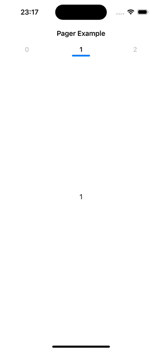

# Pager

UICollectionView based Pager ViewController.



# Usage

```swift
final class PageViewController: Pager.PageViewController, Pager.PageTabBarDataSource, Pager.PageViewControllerDataSource {
    override func viewDidLoad() {
        super.viewDidLoad()
        dataSource = self
        pageTabBar.dataSource = self
        
        navigationItem.title = "Pager Example"
        navigationItem.add(pageTabBar)
        
        reloadData()
    }
    
    func barItem(for bar: Pager.PageTabBar, at index: Int) -> String {
        "\(index)"
    }
    
    func numberOfViewControllers(in pageViewController: Pager.PageViewController) -> Int {
        3
    }
    
    func viewController(for pageViewController: Pager.PageViewController, at index: Int) -> UIViewController? {
        UIHostingController(rootView: Text("\(index)"))
    }
}
```

## Contributing

Let people know how they can contribute into your project. A contributing guideline will be a big plus.

## License

This project is licensed under the terms of the MIT license. See the [LICENSE](LICENSE) file for details.
