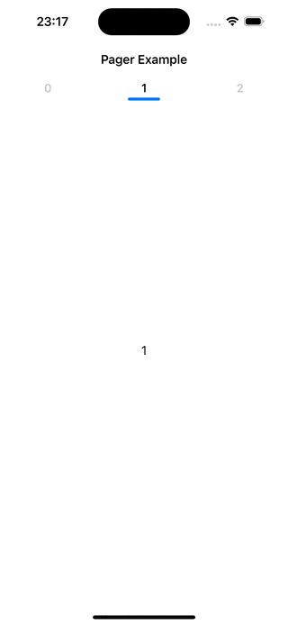

# Pager

UIKit pager view controller with a scroll-synced tab bar and indicator, built on compositional layout and diffable data sources.



## Features
- Host any `UIViewController` per page via `Page` providers; works inside navigation or tab stacks.
- Scroll-synced tab bar whose indicator width follows the current label; optional selection haptics.
- Shared tab bar state through `PageViewController.state`, including page titles and transition progress.
- Safe rotation/resizing: keeps the current page and indicator aligned on size changes.
- Customizable content insets per page (`itemContentInsets`) for floating headers / safe areas.
- Targets iOS 18+ and visionOS 2+ (Swift tools 6.2).

## Installation (Swift Package Manager)
Add the package to Xcode or your `Package.swift`:

```swift
dependencies: [
    .package(url: "https://github.com/noppefoxwolf/Pager.git", from: "0.1.0")
]
```

Then add `Pager` to your target dependencies.

## Compatibility note

On iOS 26 and later, the background blur of the navigation bar palette does not work correctly when `UIDesignRequiresCompatibility` is set to `true`. Set it to `false` (or remove the key) to use the palette background blur normally.

## Quick start
```swift
import Pager
import SwiftUI

final class PagesViewController: PageViewController {
    override func viewDidLoad() {
        super.viewDidLoad()

        let pageTabBar = PageTabBar(state: state)

        pages = [
            Page(id: "home", title: "Home") { page in
                UIHostingController(rootView: Text(page.title))
            },
            Page(id: "list", title: "List") { _ in
                TableViewController(style: .plain)   // any UIViewController works
            }
        ]

        // Build the tab bar from the pager's shared state.
        // Place it beneath the navigation bar.
        let interaction = UIScrollEdgeElementContainerInteraction()
        interaction.scrollView = collectionView
        interaction.edge = .top
        pageTabBar.addInteraction(interaction)

        view.addSubview(pageTabBar)
        pageTabBar.translatesAutoresizingMaskIntoConstraints = false
        NSLayoutConstraint.activate([
            pageTabBar.topAnchor.constraint(equalTo: view.safeAreaLayoutGuide.topAnchor),
            pageTabBar.leadingAnchor.constraint(equalTo: view.leadingAnchor),
            pageTabBar.trailingAnchor.constraint(equalTo: view.trailingAnchor),
            pageTabBar.heightAnchor.constraint(equalToConstant: 34)
        ])

        // Keep page content clear of the tab bar
        itemContentInsets.top = 34
    }
}
```

`pages` can be updated at runtime (append/remove) and the pager refreshes automatically through diffable data sources. The pager updates `state.position` while scrolling, and selecting a tab through `PageTabBar` scrolls the pager to the corresponding page.

## Key types
- `PageViewController`: horizontally paged collection view controller exposing `pages`, `state`, `itemContentInsets`, and `reloadData()`.
- `Page`: page descriptor containing `id`, `title`, and a `viewControllerProvider`.
- `PageTabBar`: UIKit `UIView & UIContentView` wrapping the SwiftUI tab bar; initialize it with `PageViewController.state`.
- `PageTabBarState`: shared observable state used by `PageViewController` and `PageTabBar`.

## Examples
Open `Example/Example.xcodeproj` to try the interactive sample (dynamic tab add/remove, table/collection content). The preview GIF in `.github/sample.gif` was captured from this example.

## Testing
See `TESTING.md` for running the iOS simulator tests with `xcodebuild`.

## License
MIT - see the [LICENSE](LICENSE) file.
